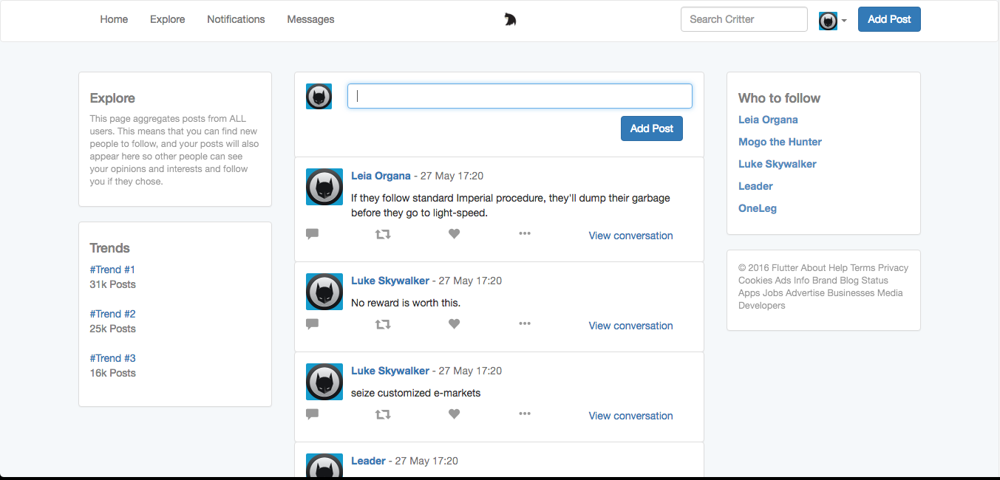
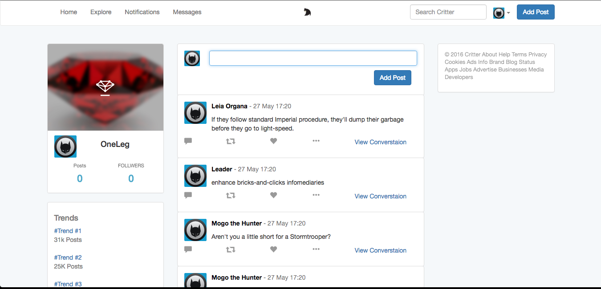
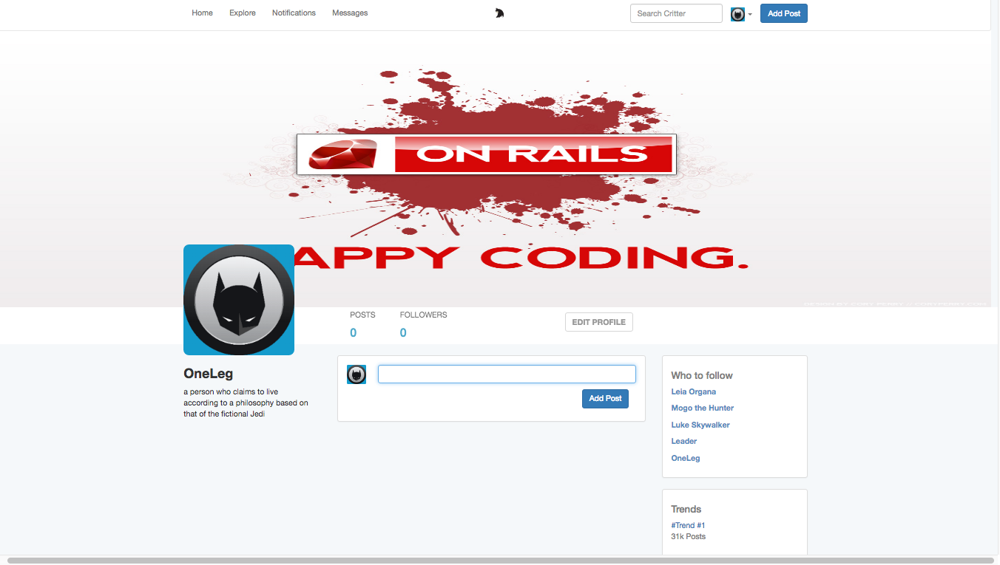

Critter(Twitter Clone)
==

Understand Gems And Their Place In Rails development. Relationships Between Models, Personalization, And Authentication.

Features:

* Ruby Version 2.3.0
* Gems and their place in Rails development
* Relationships between models
* Personalization
* Authentication
* Validations
* Controllers
* Capybara and MiniTest
* Faker(https://github.com/stympy/faker)
* Devise(https://github.com/plataformatec/devise)
* Bootstrap(http://getbootstrap.com/)

Database Creation & Initialization
==
* rake db:create
* rake db:migrate
* rake db:seed

Landing Page

==

Explore Page

==
Home Page

==
Profile Page

