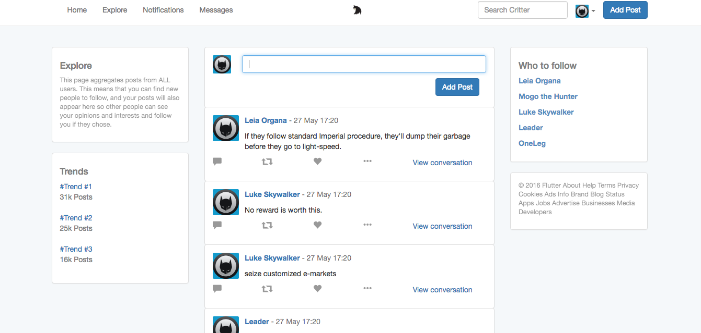
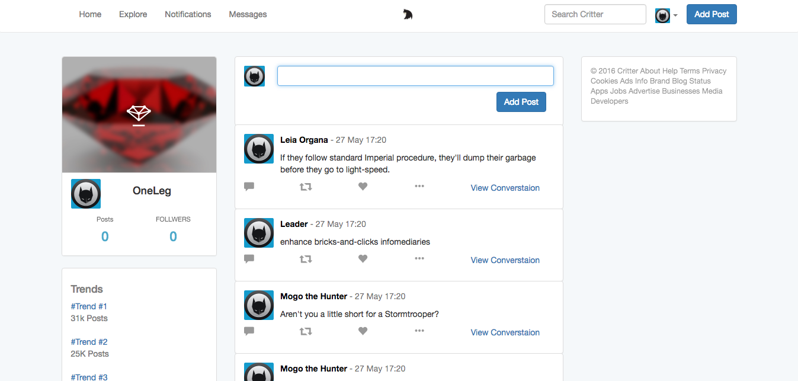

Critter(Twitter Clone)
==

Understand Gems And Their Place In Rails development. Relationships Between Models, Personalization, And Authentication.

Features:

* Understand gems and their place in Rails development
* Understand Relationships between models
* Understand Personalization
* Understand Authentication
* Faker
* Devise
* Bootstrap

Landing Page

==

Explore Page

==
Home Page

==
Profile Page

